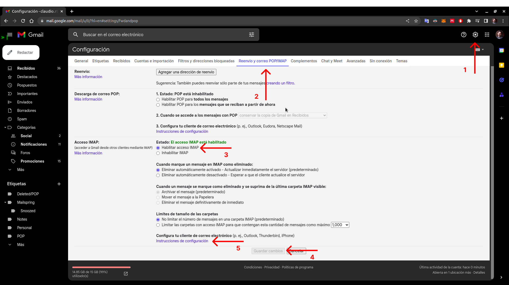
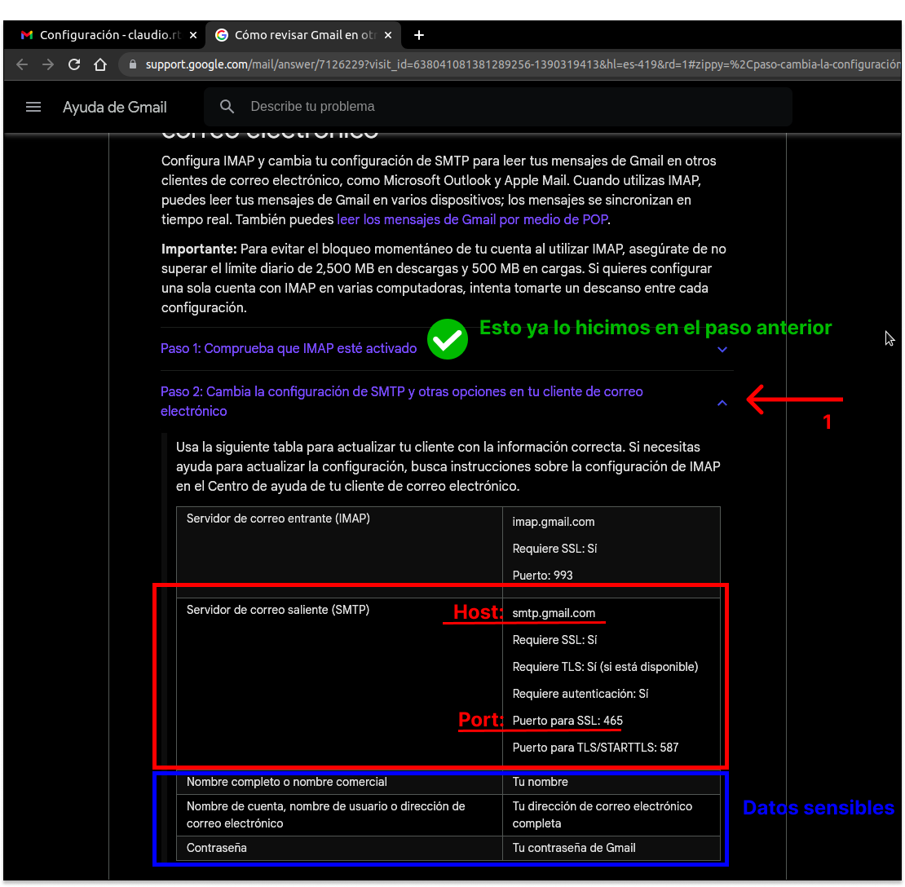
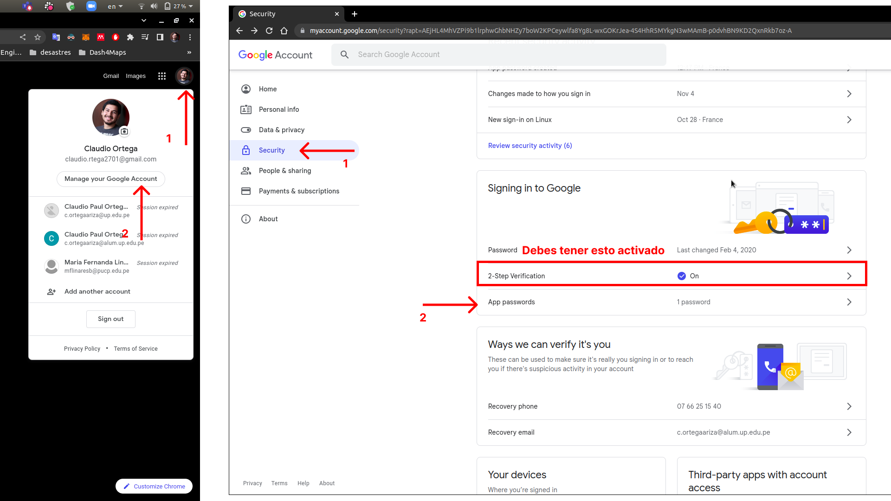
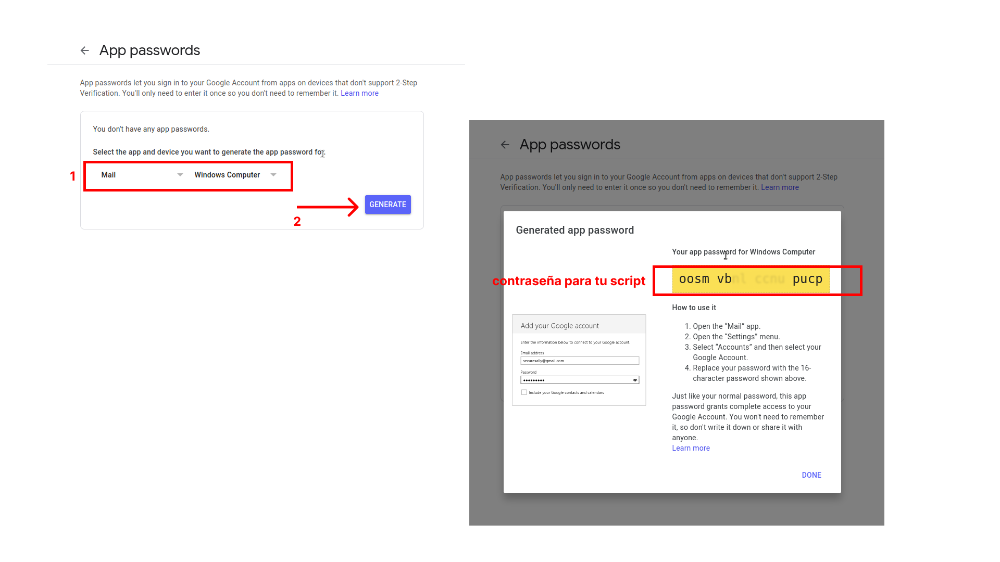

# Sesión 3: Enviando correos desde Python con Gmail y SendGrid

**Fecha:** Martes 15/11/2022 (3 horas)  
**Duracion:** 3 horas  
**Profesor(es):** Paolo Bejarano  

El objetivo del presente laboratorio es validar la comprension de las liberias smtp e email para enviar correos. Vamos a modificar la configuracion de la clase pasada para poder enviar correos reales desde:

1. Nuestro correo personal Gmail
2. Una plataforma de correo transaccional y de marketing SendGrid

## Configuracion de servidor de mail personal (gmail)

Paso 1: Activar el uso de gmail mediante servidor externo



Paso 2: Obtener las variables para conectarnos al servidor SMTP



Paso 3: Acceder a la seccion seguridad de nuestra cuenta de google*



>*Debes tener configurada la [autenticacion de doble factor](https://support.google.com/accounts/answer/185839).

Paso 4: Crear nuestra contraseña especifica para nuestra aplicacion



## Envio de correos con Python mediante el servidor de gmail

### ¿Como leemos los datos sensibles?

Opcion 1: Creamos un archivo secrets.py donde colocamos nuestros datos como variables y luego lo importamos desde nuestro script principal.

En un archivo secrets.py:

```python
USER = "username@gmail.com"
PSWD = "password"
```

En el script de python principal:

```python
from secrets import USER, PSWD

print(USER, PSWD)
```

Opcion 2: Definimos nuestras variables de entorno en un archivo '.env' y las leemos con la libreria `dotenv`

En un archivo .env:

```sh
USER=username@gmail.com
PSWD=password
```

Instalamos la libreria usando pip:

```bash
(mi_ambiente) $ pip install python-dotenv
```

En el script de python principal:

```python
import os
from dotenv import load_dotenv

load_dotenv()

USER = os.getenv('USER')
PSWD = os.getenv('PSWD')

print(USER, PSWD)
```

### Integramos nuestro codigo

Definimos el HOST y PORT para gmail:

```python
HOST = "smtp.gmail.com"
PORT = "465"
```

Finalmente, reutilizamos el codigo de la sesion anterior para enviar un **correo real**:

```python
import smtplib # Crear nuestro servidor de correo
from email.mime.multipart import MIMEMultipart
from email.mime.text import MIMEText
from secrets import USER, PSWD

HOST = "smtp.gmail.com"
PORT = "465"

recipients = ["otro@correo.com", USER]

mensaje = MIMEMultipart()
mensaje["From"] = USER
mensaje["To"] = recipients # valida enviandotelo a ti mismo
mensaje["Subject"] = "Mi primer correo automatico"
mensaje.attach(
    MIMEText("Esto es una prueba", "plain")
)

with smtplib.SMTP(host=HOST, port=PORT) as server:
  server.login(user=USER, password=PSWD)
  server.sendmail(USER, recipients, mensaje.as_bytes())

```

## Reto: Envio de correos con Python mediante el servidor de sendgrid

Pasos a seguir para hacer la configuracion de servidor de mail profesional [sendgrid](https://sendgrid.com/)

- Paso 1: Crear cuenta
- Paso 2: Activar cuenta
- Paso 3: Obtener variables del servidor (HOST y PORT)
- Paso 4: Generar clave API para nuestra aplicacion

Para enviar los correos usando el servicio de SendGrid desde Python solo debemos reemplazar en tu codigo los valores actuales de USER, PSWD, HOST y PORT por los datos de sendgrid.

[<< Inicio](README.md)  |  [< Anterior sesion](nbs/session_2.ipynb)  
