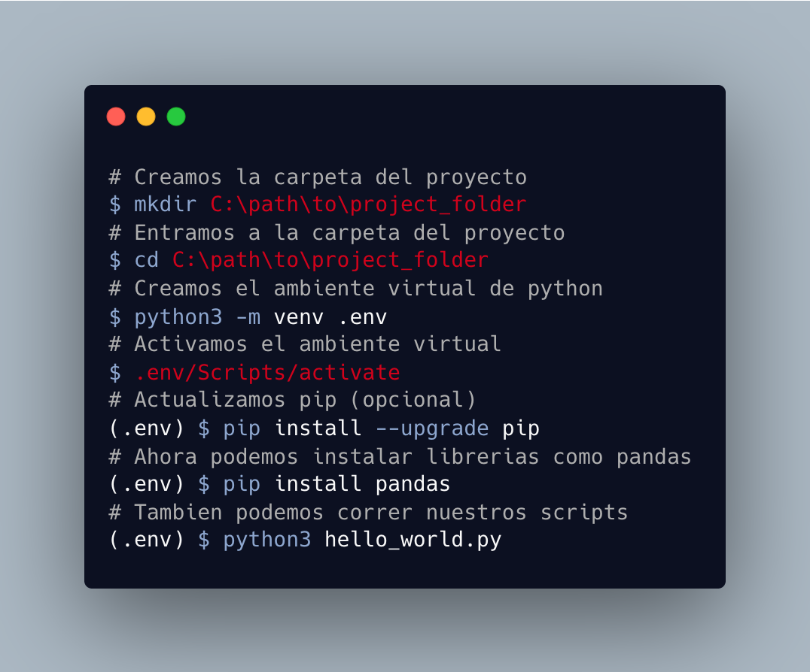
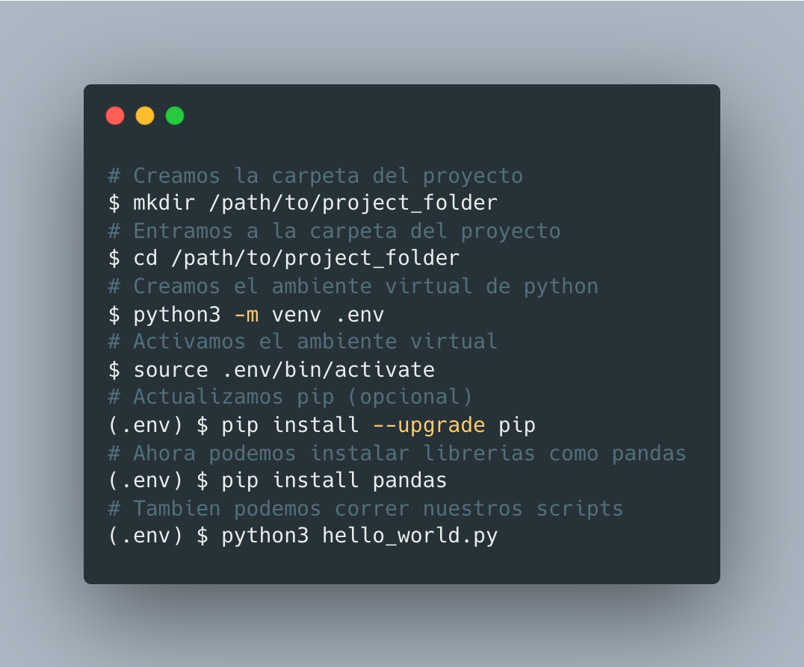

# Sesión 1: Configuracion Inicial
**Fecha:** Lunes 07/11/2022 | 21/11/2022 
**Duracion:** 3 horas
**Profesor(es):** Paolo Bejarano

> Recordemos [la introducción a la programación](https://docs.google.com/presentation/d/e/2PACX-1vS_UtPYURotAm5zGIYEBCSnHmYunLXGLN7Jgdc-zGop3z-0u6ehjMkAm9Ugm_5fDWdNoijsSV-zra0_/pub?start=false&loop=false&delayms=3000) vista en el curso de pre-selección

## 1. Instalamos Python (bien!)

Si ya tienes Python instalado en tu computadora, sabes como lo instalaste y lo utilizas sin ningun problema, puedes omitir esta seccion. 

En caso aun no tienes instalado Python recomendamos que para evitar confusiones y conflictos con otros metodos de instalacion mas pesados, avanzados y/o especificos como Anaconda siguas los pasos en la parte 1 y 2 de esta [guia](https://www.wikihow.com/Start-Programming-in-Python).

### Comprueba que hayas instalado Python correctamente

Si Command Prompt en Windows o la terminal si estas en un OS basado en Unix, y ejecuta el siguiente comando:
```
$ python --version
Python 2.7.x
```
Como pudiste ver en la guia de instalacion la version actual de python es la 3.11. Sin embargo, es muy probable que al ejecutar el comando anterior hayas visto otra version. 

En los sistemas basados en Unix (Mac OS o Linux), Python 2.7 viene preinstalado ya que es una dependencia del sistema. Por defecto el comando `python` hace referencia a esta version.

Pero ... ¿Qué paso con la version 3.11 que acabo de instalar? Pues si, para verificar la version ejecutemos un comando muy similar:
```
$ python3 --version
Python 3.11.x
```
¡Genial! Ahora nace otra pregunta: ¿Es posible instalar mas de una version al mismo tiempo? Sí, veamos este tema con mas detalle en la siguiente seccion.

## 2. Versiones de Python

A diferencia de otros programas que has utilizado, puedes instalar varias versiones de Python en la misma computadora. ¿Para que sirve esto?:

1. Utilizar librerias "antiguas" que no se han actualizado a la nueva version de Python pero las necesitas.
1. Correr tus propios pogramas desarrollados anteriormente
1. Crear nuevos programas en la ultima version de Python sin perder la capacidad de correr tus programas antiguos
1. Muchos mas ...

### ¿Como las diferenciamos?

Dependiendo de tu sistema operativo Python se instala en una ruta distinta: 

- En Linux: `/usr/bin/python3`
- En Mac OS: `/Library/Frameworks/Python.framework`, `\usr\bin\python`, `Applications`
- En Windows: `C:\Python36\`

Veamos el siguiente comando:

```bash
$ ls /usr/bin/ | grep ^python
```

El comando `ls` muestra los archivos de un directorio, en este caso el directorio sera `/usr/bin/`. El comando `grep` filtra los archivos que inicien con la palabra python (`^python`). Al correrlo tendremos un resultado similar a este:

```
python
python2
python2.7
python3
python3.10
python3.11
python3.6
python3.7
```

Esto nos indica que hay  podemos ver que hay varias versiones de python instaladas en este sistema. ¿Cuantas son?

- `python`, `python2` y `python2.7` son ejecutables de la version 2.7
- `python3` y `python3.6`, de la version 3.6
- Las demas versiones corresponden a los numeros que figuran en el nombre del archivo: 3.7 3.10 y 3.11

Ahora que ya sabemos que podemos instalar diferentes versiones de python, debemos aprender a usar de manera segura python en nuestros proyectos. Para ello utilizamos ambientes virtuales, detallaremos mas en la siguiente seccion.

## 3. Ambientes virtuales

Los ambientes virtuales son instalaciones de python (desechables) que utilizaremos especificamente para un proyecto. Son desechables porque si tenemos algun problema con el ambiente virtual simplemente lo eliminamos y podemos volver a crear uno nuevo sin problemas. 

### ¿Por que las usamos? 

- Para evitar "romper" la instalacion principal de python y afectar nuestro sistema. instalar muchas librerias en la instalacion principal de python del sistema que puedan "romperla" por incompatibilidad. 
- Para poder guardar un registro de las librerias necesarias para un proyecto especifico (Mas adelante en el curso veremos el famoso archivo `requirements.txt`)
- Existen mas razones que podemos ir viendo mas adelante ...

### ¿Como los creamos?

Desde nuestro PowerShell o Command Prompt en Windows:



> Posibles errores en Windows:
> - [Añadir variable de entorno “python” / “python3”](https://geek-university.com/python/add-python-to-the-windows-path/)
[Solución de “ejecución e Scripts está deshabilitada”]
> - (https://www.cdmon.com/es/blog/la-ejecucion-de-scripts-esta-deshabilitada-en-este-sistema-te-contamos-como-actuar)

Desde nuestro terminal en Mac OS o Linux:



## Retos: ¡Ahora te toca a ti!

1. Completa la instalacion de Python correctamente
2. Completa la creacacion de tu carpeta de proyecto
3. Crea y ejecuta tu primer script que imprima "Hello World!"
4. Instala Jupyter Notebook lo necesitaras para seguir la siguiente clase desde tu computadora ;)
