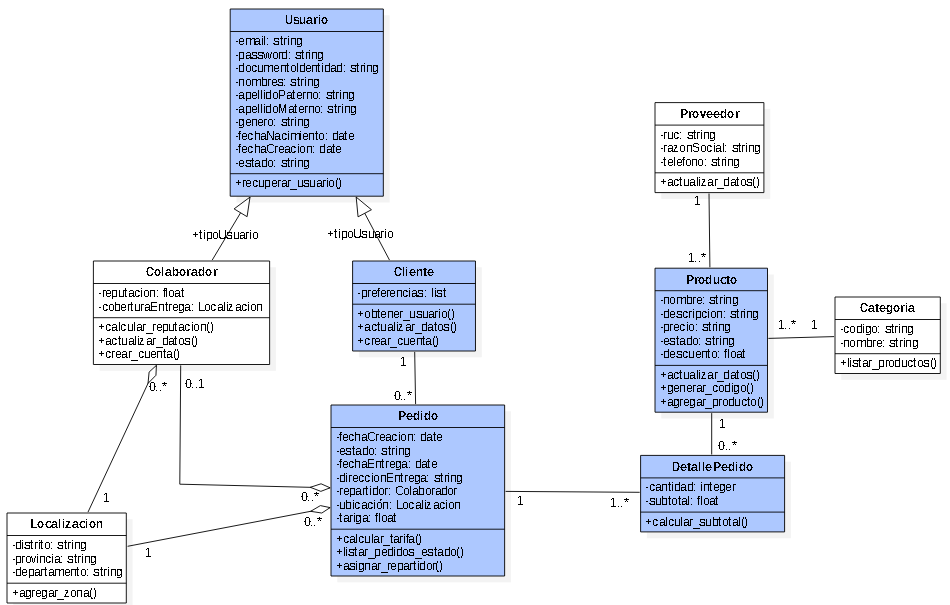



[< Volver al inicio](README.md)

# Lab 2: Modelos de Dato y Vistas Genéricas de Django

## Introducción

En este lab vamos a implementar los modelos de datos y algunas vistas simples para poder explorar los datos de productos en nuestra web app.  Los modelos de datos seran construidos a partir de un Diagrama de Clases, donde se encuentran los atributos, relaciones y operaciones que debe tener cada clase. Debemos utilizar el proyecto creado en el Lab 1, a este le anadiremos los modelos de datos, vistas y templates necesarios para este lab.

## ¿Cómo crearemos y utilizaremos las clases?

Vamos a guiarnos del siguiente Diagrama de Clases:



Ahora debemos ir al archivo `linioexp/main/models.py` y definir las clases a utilizar. Empecemos por las clases mas simples: Proveedor, Categoria Localizacion.

```python
class Proveedor(models.Model):
    ruc = models.CharField(max_length=11)
    razon_social = models.CharField(max_length=20)
    telefono = models.CharField(max_length=9)


class Categoria(models.Model):
    codigo = models.CharField(max_length=4)
    nombre = models.CharField(max_length=50)


class Localizacion(models.Model):
    distrito = models.CharField(max_length=20)
    provincia = models.CharField(max_length=20)
    departamento = models.CharField(max_length=20)
```

Antes de continuar, debemos asegurarnos de haber incluido nuestra app main dentro de nuestras aplicaciones instaladas. Para ello, debemos ir al archivo linioexp/settings.py y asegurarnos de incluir 'main.apps.MainConfig' en INSTALLED_APPS.

```python
INSTALLED_APPS = [
  'main.apps.MainConfig',
  'django.contrib.admin',
  'django.contrib.auth',
  'django.contrib.contenttypes',
  'django.contrib.sessions',
  'django.contrib.messages',
  'django.contrib.staticfiles',
]
```

Una vez que hayamos definido estas clases y nuestra aplicación main esté incluida en las aplicaciones instaladas, estamos listos para hacer las **migraciones**. Este es el nombre del proceso que Django realiza para convertir el código de Python en SQL y finalmente crear una base de datos con la que podamos interactuar. Para ello debemos realizar dos comandos desde el terminal:

```sh
python manage.py makemigrations
python manage.py migrate
```

Este proceso se debe repetir cada vez que realicemos un cambio en el archivo models.py o agreguemos una django app externa que lo requiera.

### ¿Qué hay de las relaciones entre clases?

Pues son muy simples, Django ya tiene algo hecho para nosotros. Veamos como definir las relaciones entre Proveedor y Categoria con la clase Producto:

```python
class Producto(models.Model):
    # Relaciones
    categoria = models.ForeignKey('Categoria', on_delete=models.SET_NULL, null=True)
    proveedor = models.ForeignKey('Proveedor', on_delete=models.SET_NULL, null=True)

    # Atributos
    nombre = models.CharField(max_length=20)
    descripcion = models.TextField()
    precio = models.FloatField()
    estado = models.CharField(max_length=3)
    descuento = models.FloatField(default=0)
```

El módulo `models` de Django tiene el campo `ForeignKey` para definir relaciones de "1 a muchos" o "0 a muchos" entre las clases. Así mismo hay muchos más campos que puedes encontrar en la documentación.

⚠️ Acuérdate de que debemos aplicar los cambios en la clase Producto a la base de datos a través de los comandos `python manage.py makemigrations` y `python manage.py migrate`.

### ¿Y las operaciones/métodos ?

Django sabe de estos métodos y tiene un montón de métodos pre-implementados. Pero también te permite añadir métodos personalizados a la clase.

```python
class Producto(models.Model):
  # Relaciones

  ...

  # Atributos

  ...

  def precio_final(self):
    return self.precio * (1 - self.descuento)

  def sku(self):
      codigo_categoria = self.categoria.codigo.zfill(4)
      codigo_producto = str(self.id).zfill(6)

      return f'{codigo_categoria}-{codigo_producto}'
```

El primer método nos permitirá calcular el precio final del producto (aplica el descuento, si es que existe). Por otro lado, el segundo método nos permite generar un codigo SKU (Stock Keeping Unit). Debido a que es un ejemplo, es un codigo muy simple.

> ¿Qué es `self`?
self dentro de una clase de python hace referencia a la misma clase. Es decir si tengo la clase Persona y su atributo nombre es "Gerardo", para acceder al atributo dentro de la clase debo utilizar `self.Gerardo`


## Conozcamos el Django Admin

Django sabe que trabajar con datos es un dolor de cabeza. Por ello han desarrollado una interfaz de administrador donde podrás hacer cualquier operación CRUD (create, read, update & delete). Para poder ver nuestros modelos de datos en esta interfaz primero debemos registrarlos. Para ello debemos ir al archivo `linioexp/main/admin.py`, debemos importar las clases del modulo models y utilizar las siguiente funciones:

```python
from django.contrib import admin

from .models import Localizacion, Producto, Categoria, Proveedor

# Register your models here.
admin.site.register(Localizacion)
admin.site.register(Producto)
admin.site.register(Categoria)
admin.site.register(Proveedor)
```

Ahora debemos crear una cuenta de administrador. Coloca en el terminal:

```sh
python manage.py createsuperuser
```

Completa los datos que te solicitan y listo. Ahora ingresa mediante tu navegador a [localhost:8000/admin].

### ¿Tengo que agregar los productos uno por uno?

¡Felizmente no! Tu JP ya se quedó hasta las 2am - procastinador #1 - creando un archivo para que solo lo descargues de este [link](https://raw.githubusercontent.com/IngenieriaUP/dse-project/02-add-products/linioData.json) y lo guardes dentro de tu proyecto `linioexp` (Click Derecho > Guardar Como > Guardar) y ejecutes el siguiente comando desde terminal:

```sh
python manage.py loaddata linioData.json
```

Ahora vuelve al navegador y ¡voilà! Habemus data.

## Ok, tengo datos y una pagina rara. ¿Ahora qué?

Tranqui, solo falta un poquito para poder mostrarle nuestros productos a los clientes, o algo así.

Ahora debemos crear nuestras vistas. Nuevamente Django tiene algunas clases pre-implementadas para mostrar **listas** de objetos y el **detalle** de un objeto especifico utilizando su id. Las vistas las definiremos en el archivo `linioexp/main/views.py`. Primero impotaremos las clases pre-implementadas y luego importaremos nuestra clase Producto:


```python
...
from django.views.generic import ListView, DetailView

from .models import Producto
```

Usaremos ListView para mostrar una lista de productos:

```python
class ProductListView(ListView):
    model = Producto
```

¿Viste? ¡Solo 2 lineas de codigo! Gracias django. Hagamos lo mismo para la vista del detalle de un producto:

```python
class ProductDetailView(DetailView):
    model = Producto
```

Las vistas necesitan ser referenciadas por una url. Para esto vamos al archivo `linioexp/main/urls.py` y las registramos:

```python
...
urlpatterns = [
    ...
    path('productos', views.ProductListView.as_view(), name='product-list'),
    path('productos/<int:pk>', views.ProductDetailView.as_view(), name='product-detail'),
]
```

Finalmente debemos crear los archivos HTML. Estos archivos están en un lenguaje de etiquetas. Básicamente sirve para indicarle a la web dónde debe mostrar cada elemento.

Django va leer dos archivos:

- `producto_list.html`
- `producto_detail.html`

Los podríamos colocar en cualquier app de Django dentro de una carpeta llamada `templates`. Pero para ser ordenados creemos una carpeta `templates` dentro de `linioexp/main` y a su vez dentro de  `templates` una carpeta llamada  `main`, suena un poco repetitivo pero a medida que el proyecto se haga mas grande nos servirá.

Dentro de `linioexp/main/templates/main/producto_list.html` coloquemos lo siguiente:

```HTML
<!DOCTYPE html>
<html lang="en" dir="ltr">
  <head>
    <meta charset="utf-8">
    <title> LinioExp </title>
  </head>
  <body>
    <h1> LinioExp </h1>
    <hr>
    <h3> Productos </h3>
    <ul>
      
        <li>
          <a href="">
            {{ producto.nombre }}
          </a>
          - {{ producto.precio }}
        </li>
      
        <li>Aun no hay productos disponibles.</li>
      
    </ul>
    <hr>
    <ul>
      <li> <a href="">Inicio</a> </li>
    </ul>
  </body>
</html>
```

Y dentro de `linioexp/main/templates/main/producto_detail.html` coloquemos lo siguiente:

```HTML
<!DOCTYPE html>
<html lang="en" dir="ltr">
  <head>
    <meta charset="utf-8">
    <title> LinioExp </title>
  </head>
  <body>
    <h1> Linio Exp </h1>
    <hr>
    <h3> {{ object.nombre }} </h3>
    <ul>
      <li><strong>Precio:</strong> {{ object.precio }}</li>
      <li><strong>Descripcion:</strong> {{ object.descripcion }}</li>
      <li><strong>Categoria:</strong> {{ object.categoria.nombre }}</li>
      <li><strong>Proveedor:</strong> {{ object.proveedor }}</li>
    </ul>
    <hr>
    <ul>
      <li><a href="">Ver Lista de Productos</a></li>
      <li><a href="">Inicio</a></li>
    </ul>
  </body>
</html>
```

Ahora vayamos a la url [localhost:8000/productos] y ¡listo! Vemos nuestros productos y si hacemos click en los links, nos lleva a las distintas partes de nuestra aplicación web.

## ¿Y si quiero compartir mi código cómo hago?

Para eso está Github (o cualquier otro servicio similar). Primero debemos crearnos una cuenta en Github [desde aquí](https://github.com/join?ref_cta=Sign+up&ref_loc=header+logged+out&ref_page=%2F&source=header-home).

Luego, para Windows, puedes seguir este [tutorial de instalación](https://phoenixnap.com/kb/how-to-install-git-windows)

Antes de empezar, es necesario crear el repositorio en Github desde tu perfil dando click en `New`. SOLO completa el nombre y la descripción al crear el repo y puedos ponerlo en público. Con ello, nos dirigimos a la carpeta principal desde el terminal si estas en Mac o desde GIT si estas en windows y hacemos lo siguiente:

```sh
git init
```

Agregamos a la carpeta principal el gitignore, el cual sirve para ignorar todos los archivos que nos son importantes. Para esto crearemos un file **desde Visual Studio Code** dentro de nuestra carpeta principal llamado `.gitignore` y el contenido copiarlo [desde aquí](https://github.com/Mapaz04/linioexp/blob/main/.gitignore). No te preocupes si no ven el archivo desde tu Explorador, esta es una carpeta oculta. Seguimos agregando todas nuestras carpetas en el repositorio utilizando

```sh
git add .
```

> Dado que es la primera vez que utilizamos Github, siempre usemos el comando `git status`

A patir de este punto son pasos que se ven dentro de Github luego de creado el repo. A continuación hacemos nuestro primer **commit** usando el comando

```sh
git commit -m "mi primer commit"
```

Luego seguimos los pasos que muestran en github, aquí cambiamos el nombre de la rama principal a `main`en vez de `master`

```sh
git branch -M main
```

Después vamos a agregar todo a la nube usando lo siguiente:

```sh
git remote add origin https://github.com/{usuario}/{nombre-repo}.git
```

Finalmente usamos el comando, después le debes dar refrescar al repo en github y debes ver todos tus archivos :D

```sh
git push -u origin main
```

Estos pasos también los encontrarás al crear tu primer repositorio vacío.

## Siguiente Lab

1. Deben terminar de implementar las clases que faltan y subir su proyecto a Github (1 por grupo). Se evaluará la presentación del proyecto subido y funcionando.

2. Aprenderemos como crear formularios y utilizar los datos de los usuarios.

3. Si nos da el tiempo veremos un poco más sobre HTML, JS y CSS para hacer nuestra pagina más bonita y dinámica.


[< Anterior lab](lab2.md)  
[Siguiente lab >](lab4.md)
